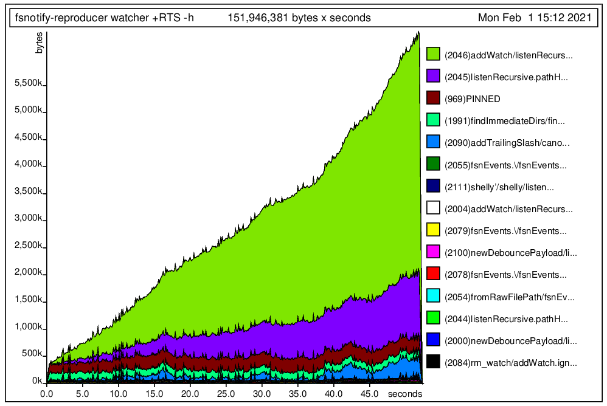

# fsnotify-reproducer

Reproducer demonstrating space leak in fsnotify.

## How to reproduce the issue

```bash
# Build this project with profiling enabled
stack build --profile

# Run executable that watches current directory + flag to enable memory profiling
stack exec --profile fsnotify-reproducer -- watcher +RTS -h

# In separate terminal window (still in the root of this repo) run executable
# which generates bunch of directory/file creation and deletion activity
stack run fsnotify-reproducer -- generator

# After 100k events is generated, CTRL+C watcher binary and generate heap profile
hp2ps -c fsnotify-reproducer.hp

# open fsnotify-reproducer.ps in your favourite viewer
```

## Profiling results

[]
